Mata Kuliah: Web Programming 2

Dosen pengampu: Muhammad Ikhwan Fathulloh

# Kelompok 10
- Proyek: Sistem Bisokop
- Anggota:
  > Riska Raysa Noor - 21552011393
  
  > Pesta Natalia Gultom - 21552011443

# Judul Proyek : VIBESid

# Penjelasan proyek
Sistem Tiket Bioskop
1.  Antarmuka Pengguna (User Interface)
    Beranda: Halaman utama yang menampilkan informasi film terbaru dan sedang tayang.
    Daftar Film: Menyajikan daftar film yang sedang tayang beserta informasi terkait seperti sinopsis, trailer, genre.
    Jadwal Tayang: Menampilkan jadwal tayang film di berbagai Bioskop dan Studio yang tersedia. Pengguna dapat melihat jam tayang film dan memilih jadwal yang sesuai.
2.  Pemesanan Tiket (Ticket Booking)
    Pemilihan Bioskop dan Jadwal: Pengguna dapat memilih bioskop dan jadwal tayang yang diinginkan.
    Pemilihan Kursi: Menampilkan layout bioskop untuk memilih kursi yang tersedia. Beberapa sistem menawarkan peta interaktif untuk memudahkan pemilihan kursi.
    Detail Pemesanan: Menampilkan rincian pemesanan : Lokasi Bioskop, nomor studio, jumlah kursi dan keterangan kursi yang dipilih, jumlah tiket, harga, dan total pembayaran.
4. Pembayaran (Payment)
   Pada Struk payment terdapat keterangan pesanan paid dan unpaid, untuk menunjukkan bahwa pesanan sudah dibayar oleh user
5. Manajemen Pengguna (User Management)
    Akun Pengguna: Pengguna dapat membuat akun untuk menyimpan user profile, informasi pemesanan, preferensi film, dan histori pembelian.
    Pengaturan Profil: Memungkinkan pengguna untuk mengatur informasi pribadi dan metode pembayaran yang disimpan.

# Pembagian Tim
> Pesta Natalia Gultom - 21552011443 : Upload Laravel

> Riska Raysa Noor - 21552011393 : Upload README.md dan Index.html

# Demo Proyek

<ul>
    <li>Landing Page : 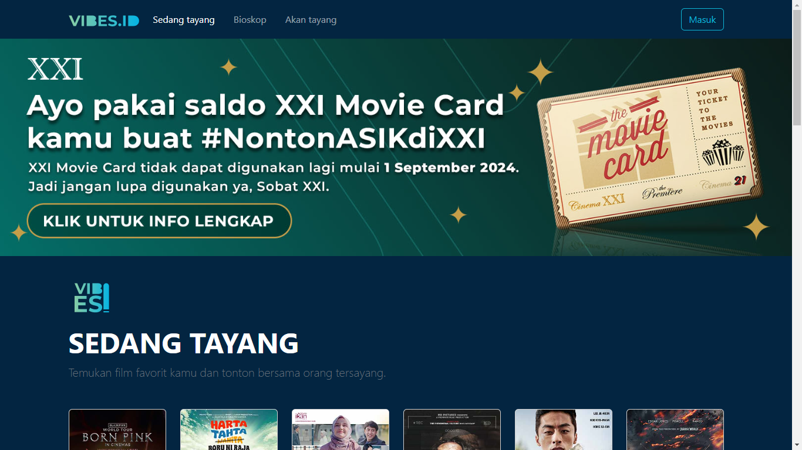</li>
    <li>Sedang tayang : 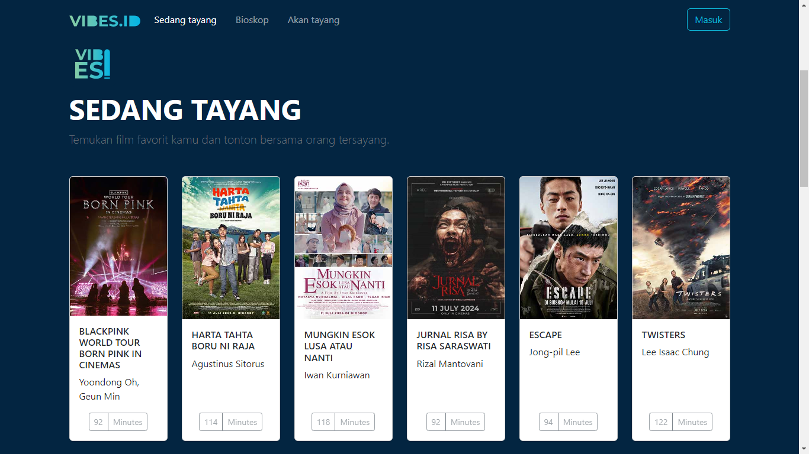</li>
    <li>Bioskop : </li>
    <li>Akan tayang : 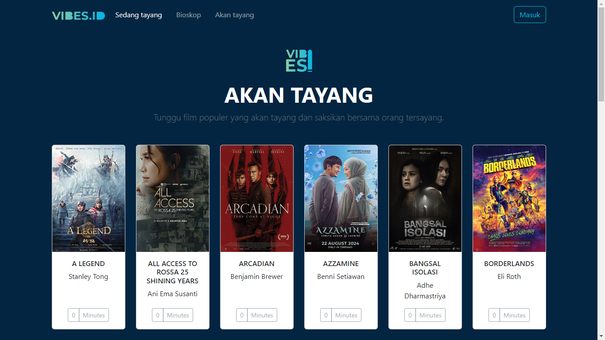</li>
    <li>Login : 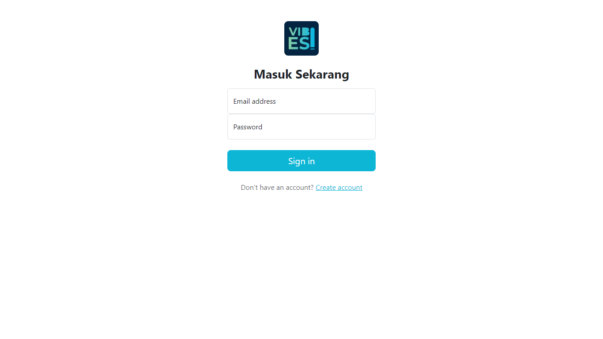</li>
    <li>Register : 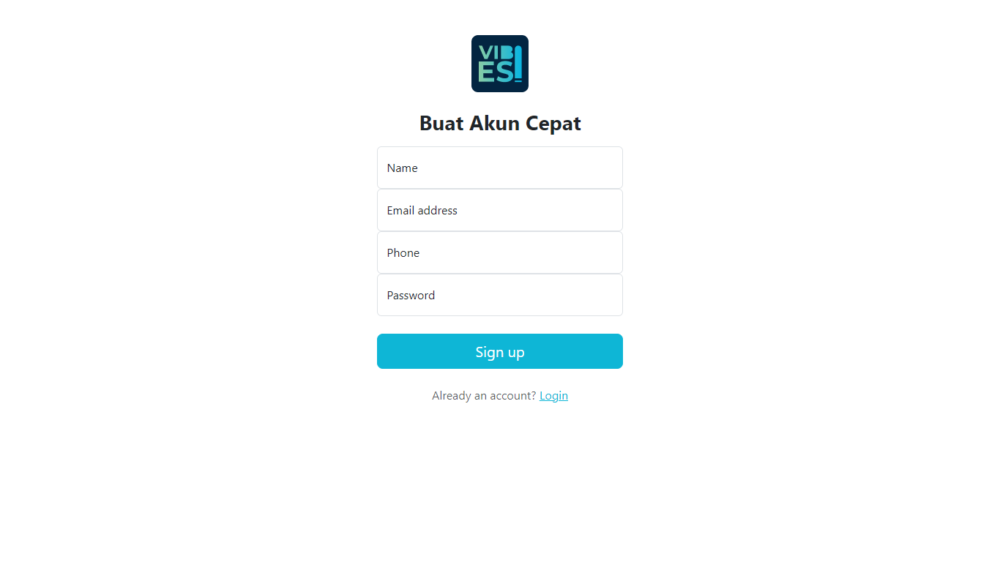</li>
    <li>Detail Movie : 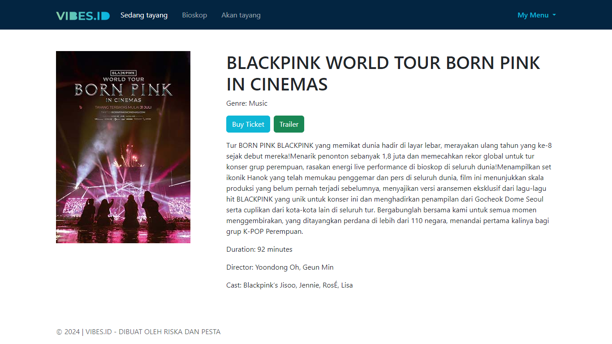</li>
    <li>Movie Theater : 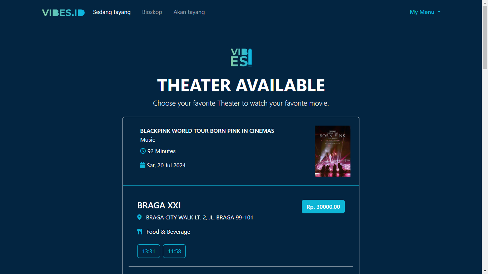</li>
    <li>Kursi : 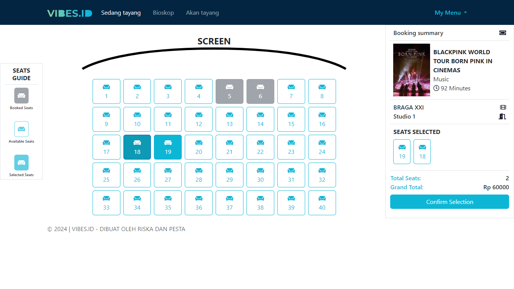</li>
    <li>Tiket : 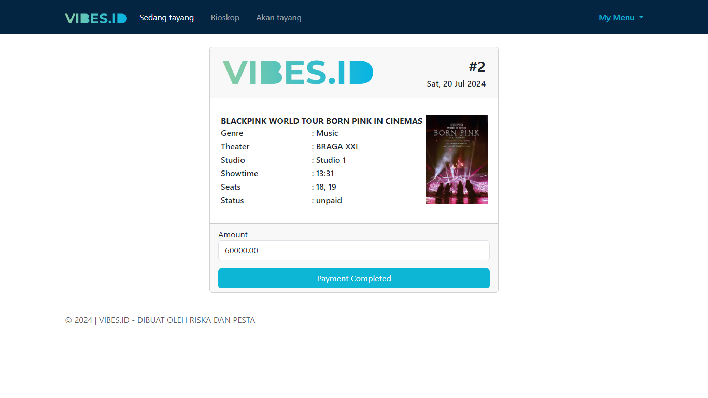</li>
    <li>Payment : 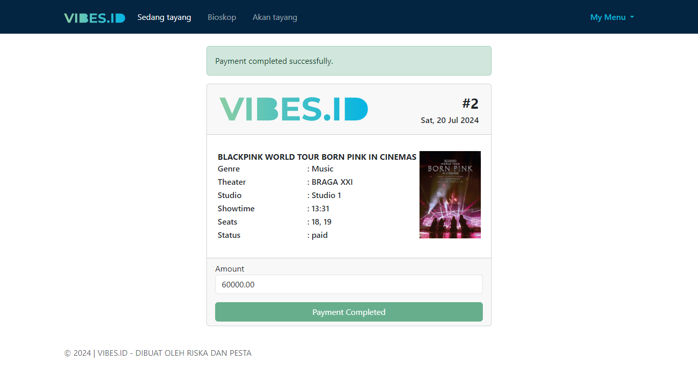</li>
    <li>Riwayat Pesanan : 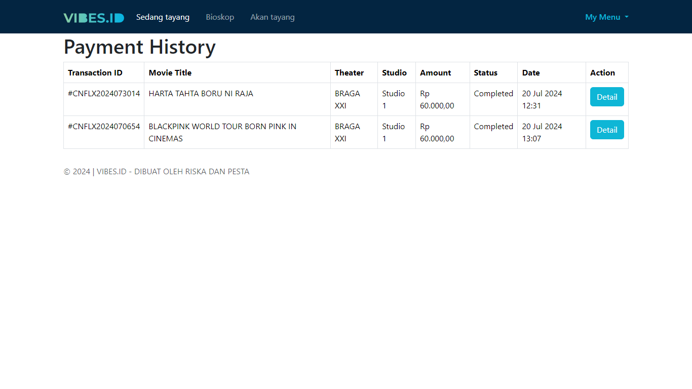</li>
    <li>Profile : 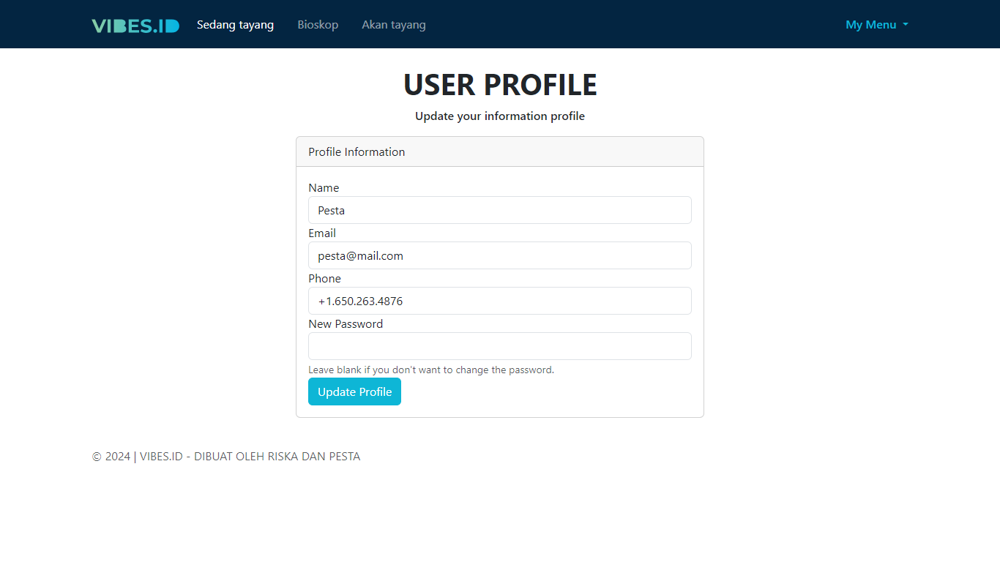</li>
</ul>

- Github:
  
- Youtube: 

