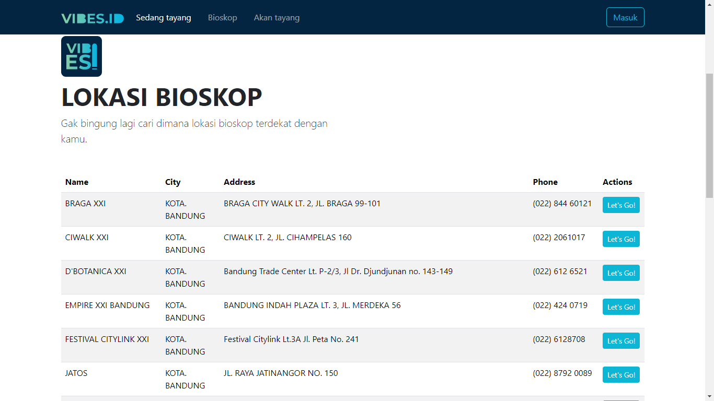

Mata Kuliah: Web Programming 2

Dosen pengampu: Muhammad Ikhwan Fathulloh

# Kelompok 10
- Proyek: Sistem Bisokop
- Anggota:
  > Riska Raysa Noor - 21552011393
  
  > Pesta Natalia Gultom - 21552011443

# Judul Proyek : VIBESid

# Penjelasan proyek
Sistem Tiket Bioskop
1.  Antarmuka Pengguna (User Interface)
    Beranda: Halaman utama yang menampilkan informasi film terbaru, film yang sedang populer, dan promosi khusus.
    Daftar Film: Menyajikan daftar film yang sedang tayang beserta informasi terkait seperti sinopsis, trailer, genre, dan rating.
    Jadwal Tayang: Menampilkan jadwal tayang film di berbagai bioskop. Pengguna dapat melihat jam tayang film dan memilih jadwal yang sesuai.
2. Pencarian dan Penyaringan (Search and Filtering)
    Pencarian Film: Memungkinkan pengguna untuk mencari film berdasarkan judul, genre, atau aktor.
    Penyaringan: Pengguna bisa memfilter film berdasarkan kriteria seperti tanggal tayang, lokasi bioskop, atau jenis film (2D, 3D, IMAX).
3. Pemesanan Tiket (Ticket Booking)
    Pemilihan Bioskop dan Jadwal: Pengguna dapat memilih bioskop dan jadwal tayang yang diinginkan.
    Pemilihan Kursi: Menampilkan layout bioskop untuk memilih kursi yang tersedia. Beberapa sistem menawarkan peta interaktif untuk memudahkan pemilihan kursi.
    Detail Pemesanan: Menampilkan rincian pemesanan termasuk jumlah tiket, harga, dan total pembayaran.
4. Pembayaran (Payment)
    Metode Pembayaran: Menyediakan berbagai metode pembayaran seperti kartu kredit, transfer bank, dompet digital, dan pembayaran di tempat.
    Keamanan Pembayaran: Menggunakan enkripsi dan protokol keamanan untuk melindungi data pribadi dan informasi pembayaran pengguna.
5. Manajemen Pengguna (User Management)
    Akun Pengguna: Pengguna dapat membuat akun untuk menyimpan informasi pemesanan, preferensi film, dan histori pembelian.
    Pengaturan Profil: Memungkinkan pengguna untuk mengatur informasi pribadi dan metode pembayaran yang disimpan.

# Pembagian Tim
> Pesta Natalia Gultom - 21552011443 : Upload Laravel

> Riska Raysa Noor - 21552011393 : Upload README.md dan Index.html

# Demo Proyek

<ul>
    <li>Landing Page : </li>
    <li>Sedang tayang : </li>
    <li>Bioskop : </li>
    <li>Akan tayang : </li>
    <li>Login : </li>
    <li>Register : </li>
    <li>Detail Movie : </li>
    <li>Movie Theater : </li>
    <li>Kursi : </li>
    <li>Tiket : </li>
    <li>Payment : </li>
    <li>Riwayat Pesanan : </li>
    <li>Profile : </li>
</ul>

- Github:
  
- Youtube: 

